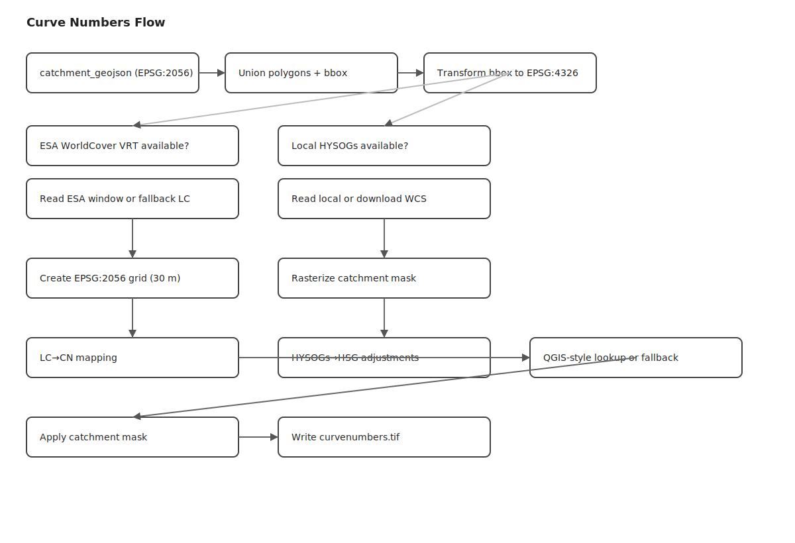

# Curve Numbers

This document describes how the curve number raster (`curvenumbers.tif`) is created for each project.

Key code: `src/api/calculations/nam.py` (task `get_curve_numbers`) and helpers within the same file.

## Overview

- Input: Project `catchment_geojson` (EPSG:2056)
- Land cover: ESA WorldCover 2021 (local VRT) or fallback
- Soils: ORNL HYSOGs250m (local GeoTIFF or WCS download) or fallback
- Output grid: EPSG:2056, 30 m resolution, clipped to project catchment
- Output: `data/{userId}/{projectId}/curvenumbers.tif`

Rendered diagram



Mermaid source (for reference):

```mermaid
flowchart TD
  A[Project catchment_geojson] --> B[Union polygons + bbox (EPSG:2056)]
  B --> C[Transform bbox to EPSG:4326]
  C --> D{ESA WorldCover VRT available?}
  D -- yes --> E[Read ESA VRT window]
  D -- no --> F[Create fallback landcover distribution]
  C --> G{Local HYSOGs250m available?}
  G -- yes --> H[Read local HYSOGs window]
  G -- no --> I[Download HYSOGs via ORNL WCS]
  E & F & H & I --> J[Create EPSG:2056 catchment grid (30 m)]
  J --> K[Rasterize catchment mask]
  E & F --> L[Landcover → CN mapping]
  H & I --> M[HYSOGs → HSG mapping + adjustments]
  L --> N[Combine LC + Soil (QGIS-style lookup or fallback)]
  M --> N
  K & N --> O[Apply catchment mask]
  O --> P[Write curvenumbers.tif]
```

## Detailed Steps

- Catchment processing
  - Parse `project.catchment_geojson` and union geometries (Shapely).
  - Compute bounds in EPSG:2056 and transform bbox to EPSG:4326 for data retrieval.

- Land cover (ESA WorldCover 2021)
  - Uses local VRT `./data/esa_worldcover_2021.vrt`.
  - Reads a window (bbox + small buffer) with Rasterio.
  - If unavailable, falls back to synthetic land-cover distribution and default CNs per ESA class.

- Soils (HYSOGs250m / Hydrologic Soil Groups)
  - Attempts local `./data/HYSOGs250m.tif` in EPSG:4326; else requests via ORNL WCS.
  - Maps HYSOGs values to HSG (A/B/C/D and mixed) with per-HSG CN adjustment factors.

- Grid and masking
  - Builds a 30 m EPSG:2056 grid covering the catchment bounds.
  - Rasterizes the catchment polygon to a binary mask.

- Curve number synthesis
  - Preferred: QGIS plugin-style lookup combining ESA land cover class and HSG to CN.
  - Fallbacks: apply land-cover CNs, then soil adjustments (ORNL/HSG/global).
  - Clamp CNs into [30, 100].

- Output
  - Apply catchment mask and write `curvenumbers.tif` (LZW compression, EPSG:2056).

## Data Inputs and Fallbacks

- ESA WorldCover (local VRT)
  - Classes retained; CN values assigned via lookup or defaults if fallback.
- HYSOGs250m (local or WCS)
  - Values mapped to HSG; HSG adjustments modify CN spatially.
- Fallbacks
  - Land cover: synthetic distribution based on latitude bands.
  - Soils: synthetic distribution with plausible HSG proportions and adjustments.

## Output Characteristics

- Projection: EPSG:2056 (Swiss coordinate system)
- Resolution: ~30 m
- NoData handling: masked outside catchment
- Path: `data/{userId}/{projectId}/curvenumbers.tif`
