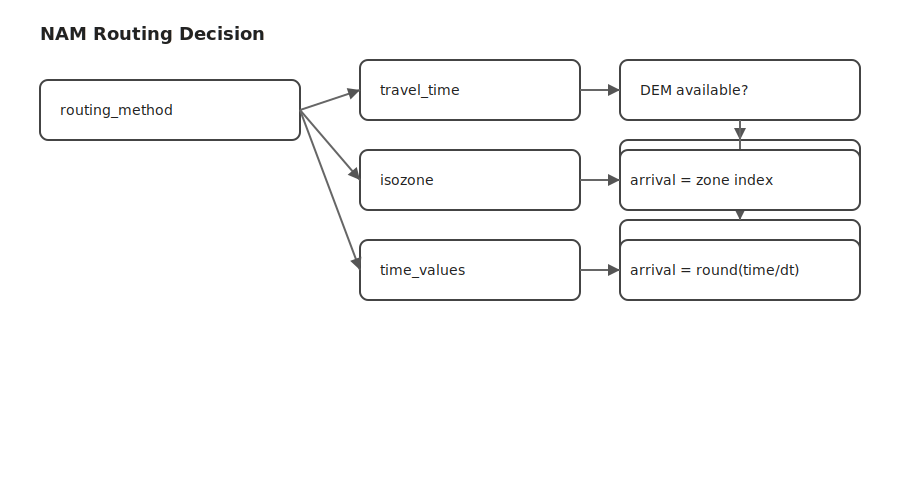
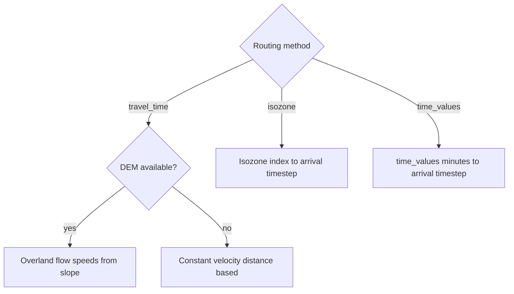

# NAM Model

This document describes the NAM rainfall–runoff computation implemented in `src/api/calculations/nam.py` (task `nam`). It uses distributed curve numbers and routing rasters to estimate discharge time series and peak discharge (HQ).

## Inputs

- IDF parameters: `P_low_1h`, `P_high_1h`, `P_low_24h`, `P_high_24h`, `rp_low`, `rp_high`, `x` (target return period)
- Project hydrology: `catchment_area`, `channel_length`, `delta_h`
- NAM config (from DB unless overridden):
  - `water_balance_mode` (e.g., `uniform`, `cumulative`, `simple/hybrid/conservative`)
  - `precipitation_factor` (multiplier for storm depth in some modes)
  - `storm_center_mode` (`user_point`, `discharge_point`, or `centroid`)
  - `routing_method` (`travel_time`, `isozone`, or `time_values`)
  - `readiness_to_drain` (CN adjustment applied per cell)
- Rasters: `curvenumbers.tif` (required), `isozones_cog.tif` (for `isozone`), `time_values.tif` (for `time_values`), `dem.tif` (for overland `travel_time`)
- Optional outlet: `discharge_point` and `discharge_point_crs` (`EPSG:4326`, `EPSG:2056`, or `raster`)

## High-Level Flow

Rendered diagrams


## Details

### IDF and Storm

- Constructs an IDF intensity function by log–log interpolation between 1 h and 24 h precipitation vs. log10(return period).
- Uses fixed `dt = 10 min` and storm duration `Tc_total = 60 min`.
- `P_total_storm = i(x, Tc_total) * Tc_total / 60` (mm) for uniform mode; spatial storm uses an exponential-decay distribution centered per `storm_center_mode` with default radius ≈ 3 km.

### Curve Number Adjustments

- `readiness_to_drain` is added to each cell’s CN:
  - Positive → higher CN → lower S and Ia → more Pe → higher Q/HQ
  - Negative → lower CN → higher S and Ia → less Pe → lower Q/HQ
- CNs are clamped to [30, 100].

### Retention and Abstraction (SCS)

- `S = (25400 / CN) - 254` [mm], `Ia = 0.2 * S` [mm].
- For a given precipitation `P`, if `P > Ia`, effective precipitation `Pe = (P_excess^2) / (P_excess + S)` with `P_excess = P - Ia`.

### Water Balance Modes

- `uniform`:
  - Uniform depth per cell: `P_uniform = P_total_storm * precipitation_factor`.
  - Apply SCS formula wherever `P_uniform > Ia`.
- `cumulative`:
  - Spatial storm scaled by `precipitation_factor`.
  - Iterative partitioning into infiltration and `Pe` until convergence or max iterations.
- `simple/hybrid/conservative` (current code path labeled “else”):
  - Spatial storm distribution without explicit `precipitation_factor` scaling.
  - Apply SCS formula where `P > Ia`.

### Routing Methods

- `travel_time`:
  - If DEM available: estimate overland velocity as `v ≈ 1.0 * sqrt(slope)` m/s, clamped to [0.5, 2.0] m/s. Travel time `T = L / v`.
  - If DEM missing: simpler distance-based `T = distance / 60` (m/min, i.e., 1.0 m/s).
  - Arrival timestep `i = round(T / dt)`.
- `isozone`:
  - Arrival timestep equals zone value from `isozones_cog.tif`.
- `time_values`:
  - Arrival timestep from `time_values.tif`: `i = round(time_minutes / dt)`.
  - Extends simulation horizon to cover the maximum observed travel time.

### Discharge Computation

- Convert effective precipitation to volume per cell: `volume = Pe * pixel_area_m2 / 1000` [m³].
- Sum per arrival timestep for runoff volumes; discharge per timestep: `Q = volume / (dt * 60)` [m³/s].
- `HQ = max(Q)`, record time to peak; compute water-balance diagnostics.

## Parameter Effects

- Return period `x`: increases IDF intensity → larger `P`, `Pe`, `HQ`.
- `precipitation_factor`: scales storm depth in `uniform`/`cumulative` modes; larger factor → larger `Pe`/`HQ`.
- `storm_center_mode`: relocates storm maximum; changes timing and magnitude of peak.
- `routing_method`: controls arrival timing granularity and realism; faster routing → more synchronized peaks → higher `HQ`.
- `readiness_to_drain`: shifts CN; positive increases runoff, negative increases infiltration.
- DEM presence: enables slope-aware speeds; otherwise, a constant-velocity simplification is used.

## Artifacts & Diagnostics

- Intermediate rasters saved in `./data/temp`:
  - `rain_distribution_*.tif`: spatial storm
  - `travel_times_*.tif` or `time_values_routing_*.tif`: routing diagnostics
- Returned data includes: `HQ`, `Tc`, `TB`, `i`, mean `S`, `Ia`, inferred `Pe`, time series arrays, water-balance and routing summaries.

## Decision Diagram



Mermaid source (for reference):

```mermaid
flowchart TD
  A[Load inputs and overrides] --> B[Load CN and isozones; align rasters]
  B --> C[Load DEM; align if present]
  B --> D[If time_values method: load time_values]
  C --> E[Apply readiness_to_drain to CN]
  E --> F[Compute S and Ia]
  F --> G[Build storm: IDF; dt 10 min; duration 60 min]
  G --> H[Choose center by storm_center_mode]
  H --> I[Water balance by mode to Pe per cell]
  I --> J[Compute travel time by routing method]
  J --> K[Sum runoff volumes per arrival timestep]
  K --> L[Convert to discharge (m3/s)]
  L --> M[HQ is max discharge; diagnostics]
```


