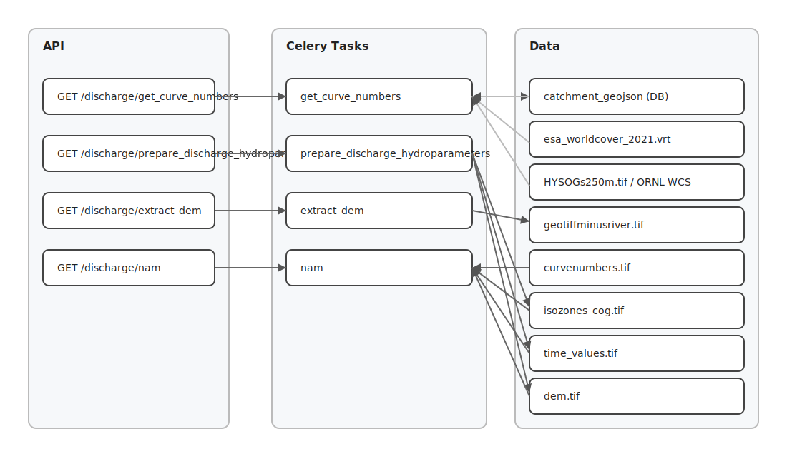
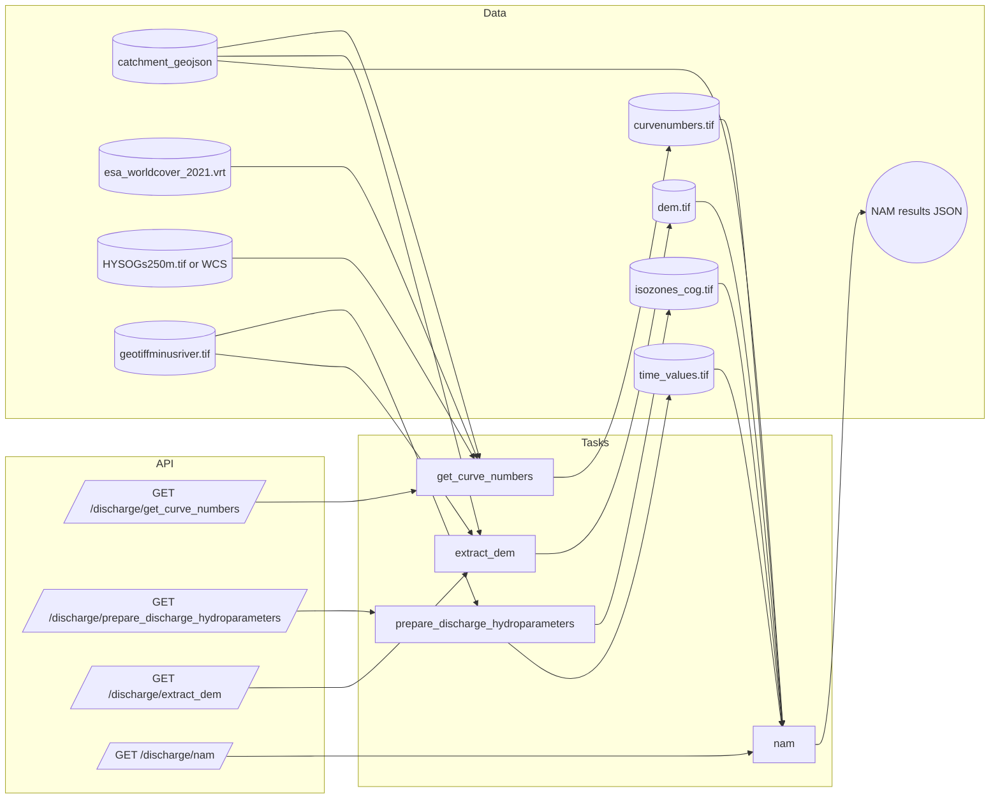

# System Overview

High-level interactions between API routes, Celery tasks, inputs, and outputs.

Rendered diagram

Mermaid source (for reference):

```mermaid
flowchart LR
  subgraph API
    R1[/GET /discharge/get_curve_numbers/]
    R2[/GET /discharge/prepare_discharge_hydroparameters/]
    R3[/GET /discharge/extract_dem/]
    R4[/GET /discharge/nam/]
  end

  subgraph Tasks
    T1[get_curve_numbers]
    T2[prepare_discharge_hydroparameters]
    T3[extract_dem]
    T4[nam]
  end

  subgraph Data
    D1[(catchment_geojson)]
    D2[(esa_worldcover_2021.vrt)]
    D3[(HYSOGs250m.tif or WCS)]
    D4[(geotiffminusriver.tif)]
    O1[(curvenumbers.tif)]
    O2[(isozones_cog.tif)]
    O3[(time_values.tif)]
    O4[(dem.tif)]
    O5((NAM results JSON))
  end

  R1 --> T1
  R2 --> T2
  R3 --> T3
  R4 --> T4

  D1 --> T1
  D2 --> T1
  D3 --> T1
  T1 --> O1

  D4 --> T2
  T2 --> O2
  T2 --> O3

  D1 --> T3
  D4 --> T3
  T3 --> O4

  O1 --> T4
  O2 --> T4
  O3 --> T4
  O4 --> T4
  D1 --> T4
  T4 --> O5
```
